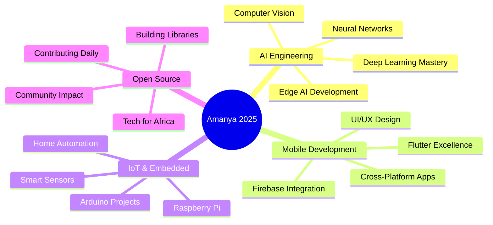

<!-- 🌍 Ultra-Modern Animated GitHub Profile -->
<!-- 🎨 HERO BANNER WITH CUSTOM GRADIENT -->
<div align="center">
  
</div>

<!-- 🎭 DYNAMIC TYPING ANIMATION (FIXED) -->
<div align="center">
  
</div>

<div align="center">
  
  ✨ **Welcome to my digital space** ✨
  
</div>

<div align="center">

### 🔎 **QUICK NAVIGATION**

[English Profile](./README_EN.md) • [Featured Projects](./PROJECTS.md) • [Collaboration Guide](./COLLABORATORS.md) • [Blog Metadata](./BLOG_POSTS.json)

</div>

---

<!-- 🎯 MODERN PROFILE CARDS SECTION -->
<div align="center">

## 🌟 **WHO AM I?**

</div>

<table align="center" width="100%">
<tr>
<td width="50%" valign="top">

### 👨‍💻 **The Developer**

```python
class AmanyaMicheal:
    def __init__(self):
        self.name = "Amanya Micheal"
        self.role = "AI Engineer & Mobile Dev"
        self.location = "Uganda 🇺🇬"
        self.education = "MUST - Computer Science"
        self.languages = ["Python", "Java", "HTML"]
        
    def current_focus(self):
        return [
            "Deep Learning & Neural Networks",
            "Mobile-First AI Applications",
            "African Tech Solutions"
        ]
    
    def life_motto(self):
        return "Code with purpose, build with passion! 🚀"
```

</td>
<td width="50%" valign="top">

### 🎯 **Quick Facts**

| 📊 | Detail |
|---|---|
| 🎓 | Computer Science @ MUST |
| 💼 | AI, Mobile Dev, IoT |
| 🌱 | Deep Learning, TensorFlow, Edge AI |
| 💡 | Innovation, Problem-Solving, Tech for Good |
| 🎵 | Coding, Learning, Building |
| ☕ | Coffee + Code + Curiosity |
| 🌍 | Tech Solutions for Africa |
| ⚡ | I debug with optimism! |

</td>
</tr>
</table>

---

<!-- 💼 TECH STACK - SIMPLIFIED -->
<div align="center">

## ⚡ **TECH STACK**

### 🔥 **Languages**


### 🤖 **AI & ML**


### 📱 **Mobile & Web**


### 🗄️ **Database & Cloud**


### 🛠️ **Tools**


</div>

---

<!-- 🚀 FEATURED PROJECTS SECTION -->
<div align="center">

## 🚀 **FEATURED PROJECTS**

*Innovative solutions built with passion and precision*

</div>

<table align="center" width="100%">
<tr>
<td width="50%" valign="top">

### 🌾 **AgroConnect Mobile**
#### Smart Agriculture Solution

[](https://github.com/michealamanya/agroconnect)

<div align="left">

- 🎯 Real-time market prices  
- 📱 Flutter & Firebase  
- 🤖 AI crop recommendations  
- 📊 Advanced analytics

</div>

**Tech Stack:** `Flutter` `Firebase` `Python` `ML`

</td>
<td width="50%" valign="top">

### 🏥 **Smart Hospital System**
#### AI Healthcare Management

[](https://github.com/michealamanya/hospital-system)

<div align="left">

- ⚕️ Patient management  
- 🤖 AI diagnosis support  
- 📈 Health monitoring  
- 🔐 Secure encryption

</div>

**Tech Stack:** `Django` `TensorFlow` `MySQL` `React`

</td>
</tr>
</table>

---

<!-- 📊 ADVANCED GITHUB STATISTICS -->
<div align="center">

## 📊 **GITHUB ANALYTICS**

*My contributions and coding journey*

</div>

<p align="center">
  
  
</p>

<p align="center">
  
  
</p>

---

<!-- 🏆 ACHIEVEMENTS & TROPHIES -->
<div align="center">

## 🏆 **ACHIEVEMENTS & MILESTONES**

*Celebrating my journey and accomplishments*


</div>

<div align="center">

### 📈 **Contribution Stats**


</div>

---

<!-- 🎯 CURRENT FOCUS & ROADMAP -->
<div align="center">

## 🎯 **CURRENT FOCUS & 2025 ROADMAP**

*My strategic vision for growth and innovation*

</div>



---

<!-- 💡 SKILLS PROGRESS BARS -->
<div align="center">

## 💡 **SKILL PROGRESSION**

*Continuous learning and mastery*

</div>

| Skill | Progress |
|---|---|
| 🤖 Artificial Intelligence |  |
| 📱 Mobile Development (Flutter) |  |
| 🌐 Web Development |  |
| 🗄️ Database Management |  |
| ⚙️ IoT & Embedded Systems |  |
| ☁️ Cloud & DevOps |  |

---

<!-- 🌐 SOCIAL LINKS WITH CUSTOM STYLING -->
<div align="center">

## 🌐 **LET'S CONNECT!**

*Reach out and let's build something amazing together*

<a href="mailto:amanyamicheal@gmail.com">
  
</a>
<a href="https://linkedin.com/in/amanya-micheal-778a9234a">
  
</a>
<a href="https://x.com/amanyamicheal_a">
  
</a>
<a href="https://github.com/michealamanya">
  
</a>

</div>

---

<!-- 📚 LATEST BLOG POSTS -->
<div align="center">

## 📚 **LATEST BLOG POSTS**

*Insights and knowledge from my tech journey*

<!-- BLOG-POST-LIST:START -->
- 🤖 [Building AI Applications for African Markets](https://medium.com/@amanyamicheal/building-ai-applications-african-markets)
- 📱 [Flutter Best Practices for Production Apps](https://medium.com/@amanyamicheal/flutter-best-practices-production)
- 🧠 [Understanding Deep Learning: A Practical Guide](https://medium.com/@amanyamicheal/understanding-deep-learning-guide)
- 🌾 [Tech Innovation in Agriculture: My Journey](https://medium.com/@amanyamicheal/tech-innovation-agriculture-journey)
- 💡 [From Student to AI Engineer: Lessons Learned](https://medium.com/@amanyamicheal/student-to-ai-engineer-lessons)
<!-- BLOG-POST-LIST:END -->

</div>

---

<!-- 🐍 CONTRIBUTION SNAKE (FIXED) -->
<div align="center">

## 🐍 **CONTRIBUTION ACTIVITY**

*Watch me code - one commit at a time*

<picture>
  <source media="(prefers-color-scheme: dark)" srcset="https://github.com/michealamanya/michealamanya/blob/output/github-contribution-grid-snake-dark.svg?raw=true">
  <source media="(prefers-color-scheme: light)" srcset="https://github.com/michealamanya/michealamanya/blob/output/github-contribution-grid-snake.svg?raw=true">
  
</picture>

</div>

---

<!-- 📈 VISITOR COUNTER & STATS -->
<div align="center">

## 📈 **PROFILE INSIGHTS**


</div>

---

<!-- 💭 INSPIRATIONAL QUOTE -->
<div align="center">

## 💭 **QUOTE OF THE DAY**


</div>

---

<!-- 🎵 PERSONAL PHILOSOPHY -->
<div align="center">

## 🎵 **MY PHILOSOPHY**

> *"Technology is not just about code, it's about creating solutions that matter.  
> Every line I write is a step toward building a better future for Africa."*

**— Amanya Micheal** ✨

---

### ⭐ **Fun Facts About Me**

| 🌅 | Early Bird | Best code is written at dawn |
|---|---|---|
| 🎮 | Tech Gamer | I debug like it's a quest |
| 📚 | Lifelong Learner | Always exploring new tech |
| ☕ | Coffee Enthusiast | Powered by caffeine & curiosity |
| 🌍 | African Innovator | Building tech that solves real problems |
| 🚀 | Dream Big | The next big thing starts with small commits |

</div>

---

<!-- 🤝 COLLABORATION SECTION -->
<div align="center">

## 🤝 **OPEN FOR COLLABORATION**

*Let's create something extraordinary together!*

🚀 **AI/ML Projects** | 📱 **Mobile Applications** | 🌍 **Tech for Social Good** | 💡 **Open Source Initiatives**

<br/>

💌 **DM me on [LinkedIn](https://www.linkedin.com/in/amanya-micheal-778a9234a) or email at amanyamicheal@gmail.com**

</div>

---

<!-- 🎯 SUPPORT SECTION -->
<div align="center">

## ☕ **SUPPORT MY WORK**

*If you find my projects helpful, consider supporting me!*

<a href="https://www.buymeacoffee.com/amanyamicheal">
  
</a>
<a href="https://ko-fi.com/amanyamicheal">
  
</a>

</div>

---

<!-- 📜 FOOTER WITH GRADIENT -->
<div align="center">


**⭐ Star my repositories if you find them useful!**

**💻 Happy Coding! | 🚀 Keep Building! | 🌍 Let's Change the World!**


---

*Last Updated: 2025 | Made with 💜 and ☕ by Amanya Micheal*

</div>
